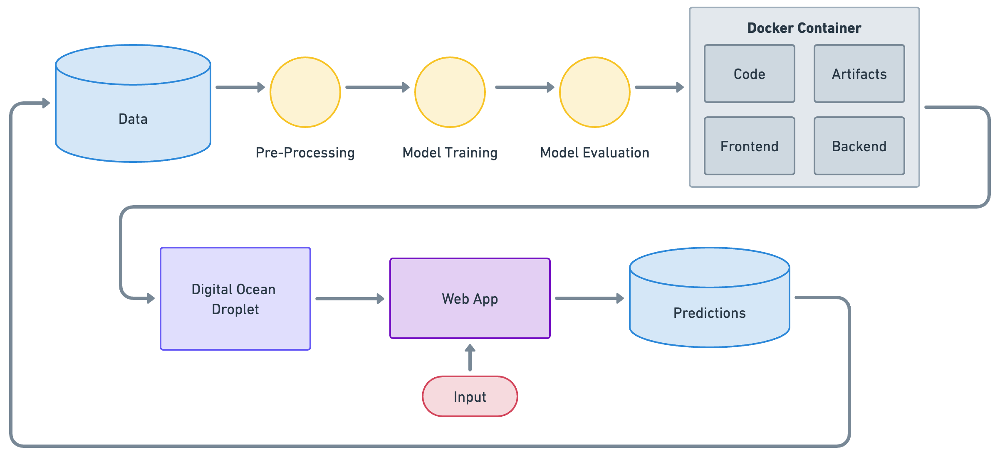

# ml-design-doc

## 1. Overview
---
This design doc outlines the development of a web application for predictive maintenance using a synthetic dataset. The application will utilize machine learning models that:

- Evaluates whether the equipment will fail or not based on process parameters, including air and process temperatures, rotational speed, torque, and tool wear.

- Identifies the type of equipment failure in the event of a failure, based on the same process parameters.

## 2. Motivation
---
Predictive maintenance can help companies minimize downtime, reduce repair costs, and improve operational efficiency. Developing a web application for predictive maintenance can provide users with real-time insights into equipment performance, enabling proactive maintenance, and reducing unplanned downtime.

## 3. Success Metrics
---
The success of the project will be measured based on the following metrics:

- Precsion, recall, and F1 score of the machine learning models.
- Responsiveness and ease of use of the web application.
- Reduction in unplanned downtime and repair costs

## 4. Requirements & Constraints
---
### 4.1 Functional Requirements

The web application should provide the following functionality:

- Users can provide the process parameters to the model and receive a prediction of whether the equipment will fail or not, and the type of failure.
- Users can view and infer the performance metrics of different machine learning models.
- Users can visualize the data and gain insights into the behavior of the equipment.

### 4.2 Non-functional Requirements

The web application should meet the following non-functional requirements:

- The model should have high precision, recall, and F1 score.
- The web application should be responsive and easy to use.
- The web application should be secure and protect user data.

### 4.3 Constraints

- The application should be built using FastAPI and Streamlit and deployed using Docker and Digital Ocean droplets.
- The cost of deployment should be minimal.

### 4.4 Out-of-scope

- Integrating with external applications or data sources.
- Providing detailed equipment diagnostic information.

## 5. Methodology
---
### 5.1. Problem Statement

The problem is to develop a machine learning model that predicts equipment failures based on process parameters.

### 5.2. Data

The dataset consists of more than 50,000 data points stored as rows with 14 features in columns. The features include process parameters such as air and process temperatures, rotational speed, torque, and tool wear. The target variable is a binary label indicating whether the equipment failed or not.

### 5.3. Techniques
---
We will utilize both a binary classification model, and a multi-class classification model to predict equipment failures, and type of equipment fauilure respectively. The following machine learning techniques will be used:

- Data preprocessing and cleaning
- Feature engineering and selection
- Model selection and training
- Hyperparameter tuning
- Model evaluation and testing

## 6. Architecture
---
The web application architecture will consist of the following components:

- A frontend web application built using Streamlit
- A backend server built using FastAPI
- A machine learning model for equipment failure prediction
- Docker containers to run the frontend, backend, and model
- Cloud infrastructure to host the application

The frontend will interact with the backend server through API calls to request predictions, model training, and data storage. The backend server will manage user authentication, data storage, and model training. The machine learning model will be trained and deployed using Docker containers. The application will be hosted on Digital Ocean droplets.

## 7. Pipeline
---

The MLOps (Machine Learning Operations) pipeline project is designed to create an end-to-end workflow for developing and deploying a web application that performs data preprocessing, model training, model evaluation, and prediction. The pipeline leverages Docker containers for encapsulating code, artifacts, and both the frontend and backend components of the application. The application is deployed on a DigitalOcean droplet to provide a cloud hosting solution.

The pipeline follows the following sequence of steps:

`Data`: The pipeline starts with the input data, which is sourced from a specified location. It can be in the form of a CSV file or any other supported format.

`Preprocessing`: The data undergoes preprocessing steps to clean, transform, and prepare it for model training. This stage handles tasks such as missing value imputation, feature scaling, and categorical variable encoding.

`Model Training`: The preprocessed data is used to train machine learning models. The pipeline supports building multiple models, allowing for experimentation and comparison of different algorithms or hyperparameters.

`Model Evaluation`: The trained models are evaluated using appropriate evaluation metrics to assess their performance. This stage helps in selecting the best-performing model for deployment.

`Docker Container`: The pipeline utilizes Docker containers to package the application code, model artifacts, and both the frontend and backend components. This containerization ensures consistent deployment across different environments and simplifies the deployment process.

`DigitalOcean Droplet`: The Docker container, along with the required dependencies, is deployed on a DigitalOcean droplet. DigitalOcean provides a cloud hosting solution that allows for scalability, reliability, and easy management of the web application.

`Web App`: The web application is accessible via a web browser, providing a user-friendly interface for interacting with the prediction functionality. Users can input new data and obtain predictions from the deployed model.

`Prediction`: The deployed model uses the input data from the web application to generate predictions. These predictions are then displayed to the user via the web interface.

`Data`: The predicted data is captured and stored, providing a record of the predictions made by the web application. This data can be used for analysis, monitoring, or further processing as needed.

## 8. Conclusion

[Click here](https://predictive-maintenance-ml.herokuapp.com/)  to use the web application.

This design doc outlines the development of a web application for predictive maintenance using a synthetic dataset. The application will utilize a machine learning model that identifies equipment failures based on process parameters, including air and process temperatures, rotational speed, torque, and tool wear. The web application will be built using FastAPI and Streamlit and deployed using Docker and Digital Ocean droplets.